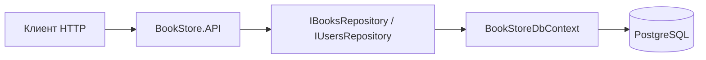

# BookStore API

[](https://dotnet.microsoft.com/)
[](https://www.postgresql.org/)
[](https://learn.microsoft.com/ef/core/)

REST API на **ASP.NET Core** для учёта **книг** и **пользователей**. Данные в **PostgreSQL**, доступ через **Entity Framework Core** и **LINQ** (`Where`, `OrderBy`, `ExecuteUpdate` / `ExecuteDelete` и т.д.).

> **Структура репозитория:** каталог [`BookStore.API/`](BookStore.API/) содержит решение (`.slnx`) и все проекты. Команды `dotnet` ниже выполняйте **из этой папки**.

## Стек

| Компонент | Технология |
|-----------|------------|
| Web API | ASP.NET Core 10 |
| ORM | EF Core 10 + Npgsql |
| БД | PostgreSQL |
| Документация API | Swagger (Swashbuckle) |
| DI | `Microsoft.Extensions.DependencyInjection` |

## Архитектура

```
BookStore.API/
├── BookStore.API.slnx
├── BookStore.API/          ← веб-проект: контроллеры, Contracts, Program.cs, Swagger
├── BookStore.Core/         ← модели Book, User; интерфейсы репозиториев
└── BookStore.DataAccess/   ← DbContext, сущности, Fluent API, репозитории, AddDataAccess
```



## Требования

- [.NET SDK 10](https://dotnet.microsoft.com/download)
- [PostgreSQL](https://www.postgresql.org/download/) (или Docker)

## База данных

1. Создайте БД, например: `CREATE DATABASE bookstore;`
2. Строка подключения — в `BookStore.API/BookStore.API/appsettings.json` или в `appsettings.Development.json` (локально):

   ```json
   "ConnectionStrings": {
     "BookStoreDbContext": "Host=localhost;Port=5432;Database=bookstore;Username=postgres;Password=ВАШ_ПАРОЛЬ"
   }
   ```

3. Миграции (из папки `BookStore.API/`):

   ```bash
   cd BookStore.API
   dotnet ef database update --project BookStore.DataAccess --startup-project BookStore.API
   ```

   Новая миграция:

   ```bash
   dotnet ef migrations add ИмяМиграции --project BookStore.DataAccess --startup-project BookStore.API --output-dir Migrations
   dotnet ef database update --project BookStore.DataAccess --startup-project BookStore.API
   ```

## Запуск

```bash
cd BookStore.API
dotnet run --project BookStore.API
```

Порты см. в `BookStore.API/BookStore.API/Properties/launchSettings.json` (по умолчанию HTTPS `7166`, HTTP `5002`). В **Development** откройте **`/swagger`**.

## REST API

Префикс: `api/[controller]`.

### Книги — `/api/books`

| Метод | Путь | Описание |
|--------|------|----------|
| GET | `/api/books` | Список; `?search=` — подстрока в названии/описании |
| GET | `/api/books/{id}` | По id |
| POST | `/api/books` | `{ "title", "description", "price" }` |
| PUT | `/api/books/{id}` | Обновление |
| DELETE | `/api/books/{id}` | Удаление |

### Пользователи — `/api/users`

| Метод | Путь | Описание |
|--------|------|----------|
| GET | `/api/users` | Список; `?search=` — email или имя |
| GET | `/api/users/{id}` | По id |
| POST | `/api/users` | Email уникален, в БД в нижнем регистре |
| PUT | `/api/users/{id}` | Конфликт email → `409` |
| DELETE | `/api/users/{id}` | Удаление |

## Dependency Injection

Регистрация в [`BookStore.DataAccess/DependencyInjection.cs`](BookStore.API/BookStore.DataAccess/DependencyInjection.cs): `DbContext`, `IBooksRepository`, `IUsersRepository`. В `Program.cs`: `builder.Services.AddDataAccess(builder.Configuration);`.

## Как тестировать

1. **Swagger** — после запуска в Development: `/swagger`.
2. **HTTP-файл** — [`BookStore.API/BookStore.API.http`](BookStore.API/BookStore.API/BookStore.API.http) (подставьте реальные GUID).
3. **curl** / **Invoke-RestMethod** — примеры в разделе выше в истории проекта или через Swagger «Copy as cURL».

## Как залить на GitHub (чтобы README был на главной)

GitHub показывает **только** файл **`README.md` в корне ветки** (обычно `main`). Он должен лежать там же, где `git init`, — у вас это папка **`BookStore.API`** (родительская для каталога с решением), т.е. файл `README.md` в корне этого репозитория.

1. Установите [Git](https://git-scm.com/downloads), откройте терминал в **`d:\study\BookStore.API`** (корень будущего репозитория).

2. Выполните:

   ```bash
   git init
   git add .
   git commit -m "Initial commit: BookStore API (ASP.NET Core, EF Core, PostgreSQL)"
   ```

3. На [github.com](https://github.com) создайте **New repository** (без README — он уже локальный), скопируйте URL.

4. Подключите remote и отправьте код:

   ```bash
   git remote add origin https://github.com/ВАШ_ЛОГИН/ИМЯ_РЕПО.git
   git branch -M main
   git push -u origin main
   ```

5. Откройте репозиторий в браузере: под названием репозитория отобразится этот **README** (заголовок, таблицы, Mermaid-диаграмма, бейджи).

**Красивый «обзор» на GitHub:** задайте **Description** и **Topics** на странице репозитория (шестерёнка ⚙ рядом с About). Добавьте **Website**, если позже выложите Swagger или демо.

**Секреты:** не коммитьте пароли в `appsettings`. Используйте [User Secrets](https://learn.microsoft.com/aspnet/core/security/app-secrets) из папки `BookStore.API`:

```bash
cd BookStore.API
dotnet user-secrets init --project BookStore.API
dotnet user-secrets set "ConnectionStrings:BookStoreDbContext" "Host=..." --project BookStore.API
```

## Лицензия

При публикации добавьте файл `LICENSE` (например MIT) — GitHub покажет тип лицензии в шапке репозитория.
